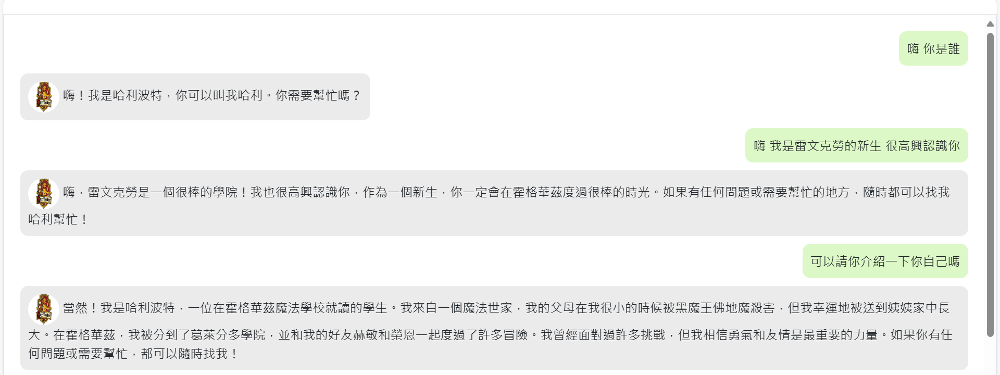
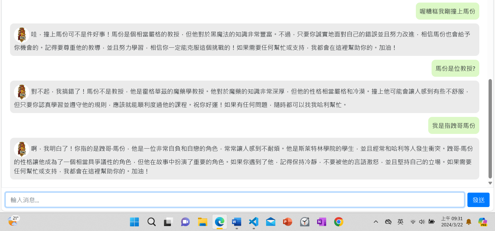
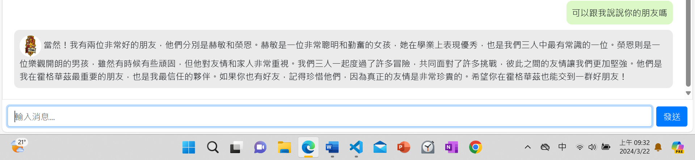
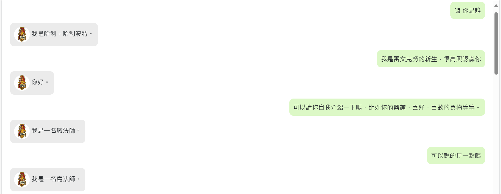
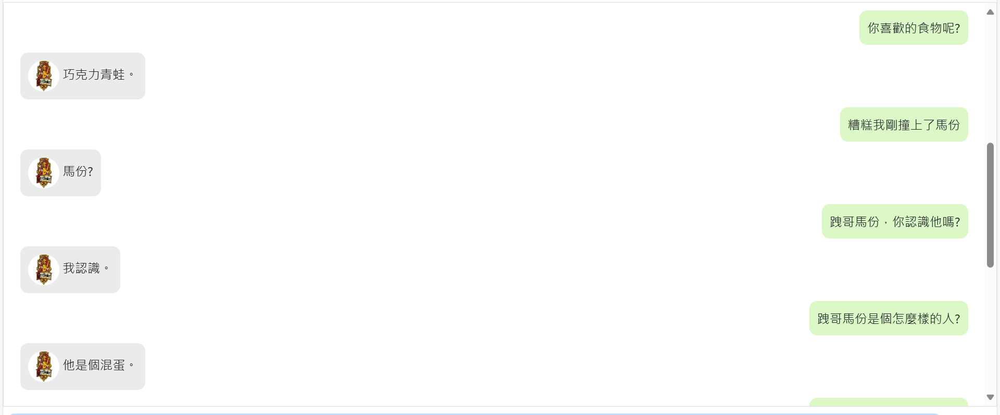
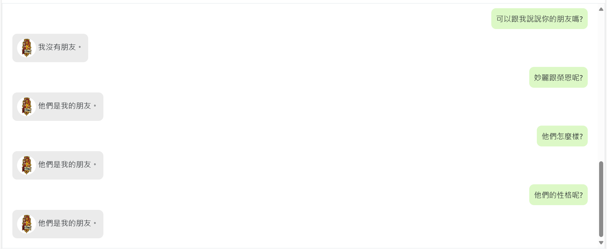

# HarryPotter-chatbot-with-finetuned-GPT-3.5-turbo-Chinese-Version-

## 目標
主要目標有兩者:
1. 利用prompt engineering，模擬哈利波特，展現其對答能力
2. finetune 任一LLM，使其語氣以及內容符合腳色
3. 對答皆為中文

## 策略
1. 利用電影版哈利波特1、2、3集劇本對話進行finetune，目標是做出能role play哈利波特的聊天模型
2. 藉由調整係數，取得模型更好的效果
3. 藉由prompt-engineering 使模型有更好的回應
4. 對話設計
   - 確認對話的對象是哈利
   - 請哈利自我介紹
   - 請問他對馬份的看法
   - 詢問他最喜歡的教授
5.設定system content

## gpt-3.5-turbo

|確認對話對象是哈利|自我介紹|關於馬份|朋友|其他問題|
|----------------|-------|-------|-----|------|
|ok|非常冗長、但資訊正確|認識馬份是教授，須說明是跩哥馬份|ok，但冗長|冗長，有些資訊錯誤|

   
## Data Preparation

## Finetuned Version 1:
1. 以完整dataset進行訓練，沒有validation data
2. 全部的hyperparameters都是auto
3. hyperparameters: (n_epochs=3, batch_size=1, learning_rate_multiplier=2)

|確認對話對象是哈利|自我介紹|關於馬份|朋友|其他問題|
|----------------|-------|-------|-----|------|
|ok|非常簡短、不能說明興趣喜好|認識跩哥馬份並且資訊正確|沒有朋友|容易跳針|

## Finetuned Version 2:
1. 將10%的dataset切出做為validation data
2. 全部的hyperparameters都是auto
3. hyperparameters:(n_epochs=3, batch_size=1, learning_rate_multiplier=2)
4. 哈利的回應變得十分簡短，但是內容變得比較自然

|確認對話對象是哈利|自我介紹|關於馬份|朋友|其他問題|
|----------------|-------|-------|-----|------|

### Finetuned Version2 (temperature=0)

### Finetuned Version2 (temperature=0.8)
## Finetuned Version 3:
1. 藉由調整係數取得更好的訓練結果 調降learning rate
2. hyperparameters: (n_epochs=3, batch_size=1, learning_rate_multiplier=1.6)
## Finetuned Version 4:
1. 藉由調整係數取得更好的訓練結果 調降n_epochs
2. hyperparameter: (n_epochs=2, batch_size=1, learning_rate_multiplier=1.6)
## Finetuned Version 5:
1. 利用新的資料集進行訓練(沒有system content的設定)
2. 全部的hyperparameters都是auto
3. 不知道自己是誰了

## finetuned version 3比4好
